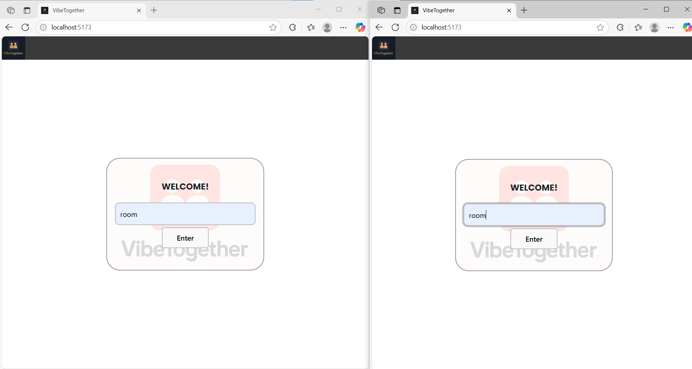
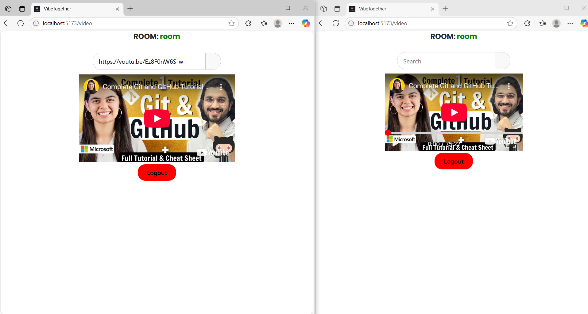
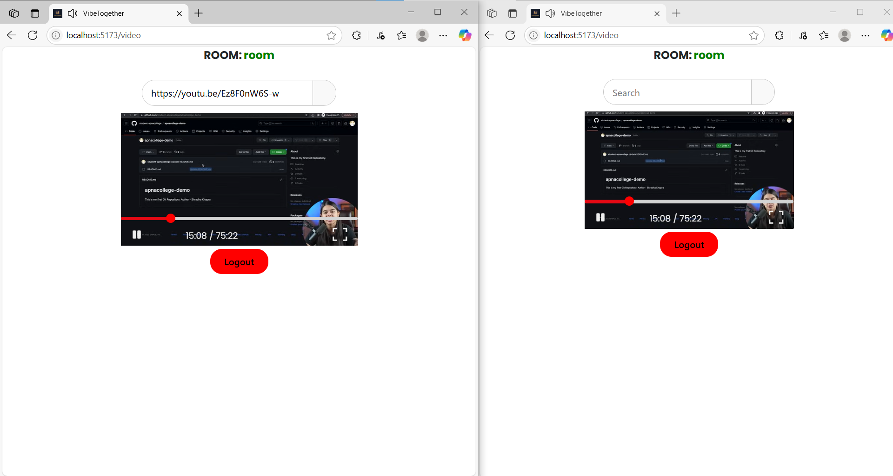

# 🎬 VibeTogether – Watch Videos Together, Remotely

**VibeTogether** is a full-stack app that allows users to watch YouTube videos together in sync.

## 🔧 Tech Stack

### Frontend – React + Vite
- Vite + React
- STOMP.js + SockJS for WebSocket
- YouTube IFrame Player API
- React Bootstrap

### Backend – Spring Boot
- Spring Boot (2.x)
- STOMP over WebSocket
- REST endpoints for additional services

---

## 🖥️ Features

- 🔗 Join rooms and watch together
- 📺 Sync YouTube video playback
- 💬 Real-time messaging via WebSockets
- 🧑‍🤝‍🧑 Invite others using room links
- 🎨 Clean, responsive UI

---

## ⚙️ Getting Started

### 1. Clone the repo

```bash
git clone https://github.com/yourusername/VibeTogether.git
cd VibeTogether


Frontend Setup (Vite + React)
bash

cd frontend
npm install
npm run dev


Backend Setup (Spring Boot)
bash

cd backend
./mvnw spring-boot:run


The WebSocket endpoint is available at:
bash

/server

Project Structure
bash

VibeTogether/
├── backend/        # Spring Boot backend
└── frontend/       # Vite + React frontend


How to Test

Open in two browser tabs
Join the same room
Test video syncing & real-time chat


ScreenShots



